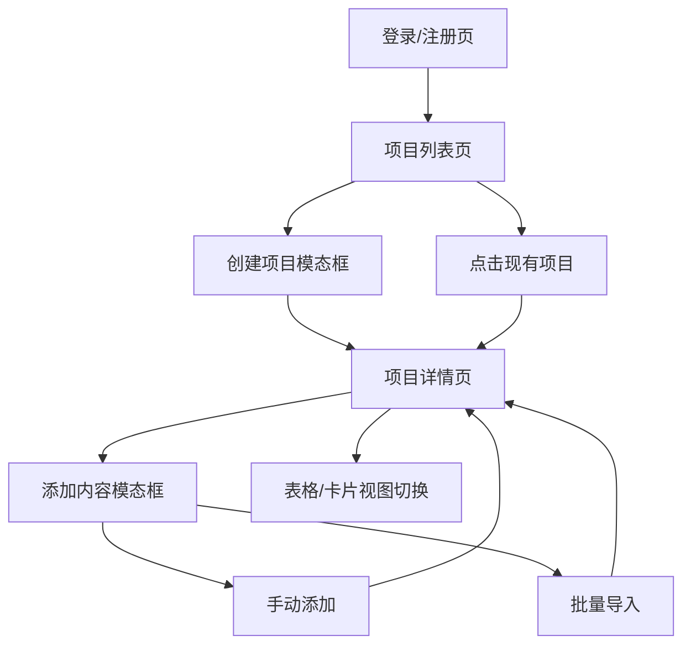

# 内容监控平台 - 产品需求文档

## 1. 产品概述

内容监控平台是一个专业的社交媒体内容数据追踪工具，用户可以创建项目、粘贴网红内容链接（YouTube/TikTok/Instagram），调用后端API获取视频统计数据，并显示所有监控内容的更新指标。

该平台解决了内容创作者、营销人员和数据分析师需要手动收集多平台内容数据的痛点，提供快速输入→数据获取的MVP解决方案。目标是成为专业且简洁的内容监控工具，参考NoxInfluencer的现代化UI设计。

## 2. 核心功能

### 2.1 用户角色

| 角色 | 注册方式 | 核心权限 |
|------|----------|----------|
| 普通用户 | 邮箱注册 | 可创建无限项目，每个项目最多监控100个内容 |
| 高级用户 | 付费升级 | 无限项目数量，每个项目无限内容，支持API导出和高级分析 |

### 2.2 功能模块

我们的内容监控平台包含以下主要页面：

1. **项目列表页**：显示所有项目、创建新项目、项目管理
2. **项目详情页**：内容监控列表、数据统计、表格/卡片视图切换
3. **内容添加模态框**：单个添加内容链接、批量导入Excel
4. **项目创建模态框**：简单的项目名称和平台选择
5. **登录/注册页面**：用户身份验证和账户创建

### 2.3 页面详情

| 页面名称 | 模块名称 | 功能描述 |
|----------|----------|----------|
| 项目列表页 | 项目卡片 | 显示项目名称、创建时间、帖子数量、总观看量、平台图标、状态 |
| 项目列表页 | 创建项目 | 点击创建按钮弹出模态框，输入项目名称和选择平台 |
| 项目详情页 | 统计卡片 | 顶部显示总观看量、总点赞数、总评论数、总分享数、参与率（保留CPM/CTR空占位符） |
| 项目详情页 | 筛选器 | 状态（全部/监控中/已完成/错误）、平台、日期范围、搜索、负责人 |
| 项目详情页 | 内容表格 | 创作者头像+姓名、平台图标、发布日期、观看数、点赞数、评论数、参与率、状态徽章、操作菜单 |
| 项目详情页 | 视图切换 | 表格视图和卡片视图两种显示模式切换 |
| 内容添加模态框 | 手动添加 | post_url（必需）、monitor_days（30/60/90）、region（可选）、remark/tag（可选）、URL自动平台检测 |
| 内容添加模态框 | 批量添加 | 上传Excel（.xlsx）、解析行（链接/备注/地区）、显示预览（成功行+失败行） |
| 项目创建模态框 | 简单表单 | 项目名称输入框和平台选择器 |
| 登录/注册页 | 身份验证 | 邮箱、密码输入，登录/注册切换，记住登录状态 |

## 3. 核心流程

**主要用户流程：**
用户登录/注册 → 项目列表页 → 创建项目（模态框） → 项目详情页 → 添加内容（模态框） → 查看监控数据 → 切换表格/卡片视图

**URL平台自动检测流程：**
youtube.com/youtu.be → youtube、tiktok.com → tiktok、instagram.com → instagram、未知→需要用户选择

**批量导入流程：**
上传Excel → 解析数据 → 显示预览（成功/失败行） → 确认导入 → 发送批量API请求

## 4. 用户界面设计

### 4.1 设计风格（参考NoxInfluencer）

- **主色调**：深蓝色 (#1a365d) 和亮蓝色 (#0ea5e9)，体现专业和现代感
- **辅助色**：灰色系 (#f8fafc, #e2e8f0, #64748b) 用于背景和文字，绿色(#10b981)和红色(#ef4444)用于状态显示
- **按钮样式**：圆角按钮 (rounded-md)，主按钮蓝色背景，次要按钮白色背景+灰色边框
- **字体**：Inter字体，标题使用16-20px，正文使用14px，数字统计使用18-24px粗体
- **布局风格**：简洁卡片式设计，顶部导航栏，左侧边栏（项目详情页），大量留白
- **图标风格**：使用Lucide或Heroicons线性图标，平台图标使用彩色显示

### 4.2 页面设计概览

| 页面名称 | 模块名称 | UI元素 |
|----------|----------|--------|
| 项目列表页 | 顶部导航 | 白色背景，Logo左对齐，用户头像右对齐，阴影分割线 |
| 项目列表页 | 项目卡片 | 白色卡片圆角阴影，项目名称粗体，统计数字蓝色显示，平台图标彩色 |
| 项目详情页 | 统计卡片 | 5个统计卡片横向排列，数字大字体显示，增长趋势绿色/红色箭头，CPM/CTR空占位符 |
| 项目详情页 | 筛选器 | 横向排列的下拉框和搜索框，简洁的灰色边框设计 |
| 项目详情页 | 内容表格 | 表格视图使用斑马纹，头像圆形显示，状态徽章彩色显示，操作菜单三点图标 |
| 项目详情页 | 卡片视图 | 3列网格布局，每个卡片显示缩略图、标题、创作者、数据统计 |
| 模态框 | 表单设计 | 居中布局，输入框有焦点状态，上传区域虚线边框，按钮右下角对齐 |
| 全局说明 | 底部文本 | 页面底部显示静态文本：YouTube刷新：10分钟、TikTok刷新：60分钟、Instagram刷新：120分钟 |

### 4.3 响应式设计

产品采用桌面优先设计，同时适配平板和移动设备。在移动端，表格视图自动切换为卡片视图，统计卡片垂直堆叠，确保在小屏幕上的良好体验。支持触摸交互优化，按钮和点击区域足够大以便手指操作。

### 4.4 特殊功能说明

- **URL平台自动检测**：系统自动识别链接所属平台，显示相应的平台图标和颜色
- **错误状态处理**：拉取中（蓝色）、监控中（绿色）、已完成（灰色）、错误（红色）状态徽章
- **批量操作反馈**：上传Excel后显示解析结果，成功行和失败行分别显示，失败原因提示
- **实时数据更新**：数据刷新频率在页面底部显示，让用户了解数据更新频率