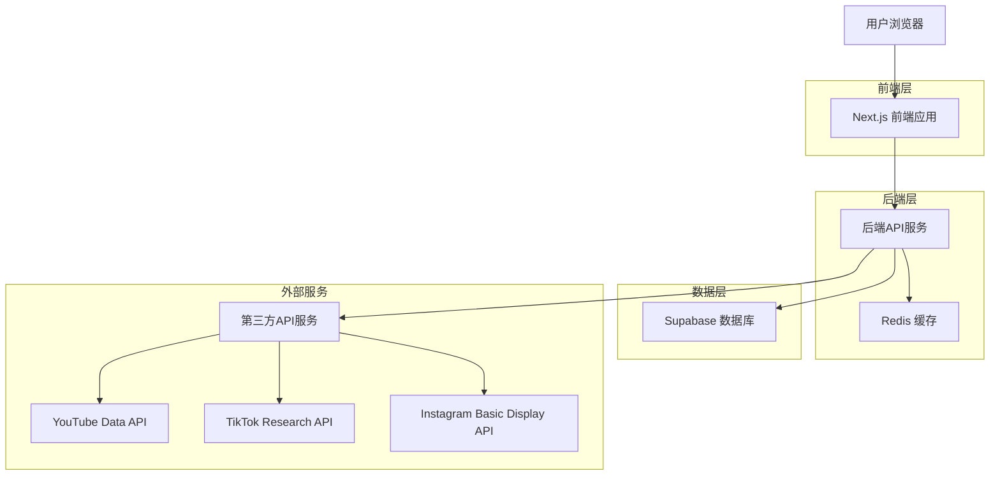
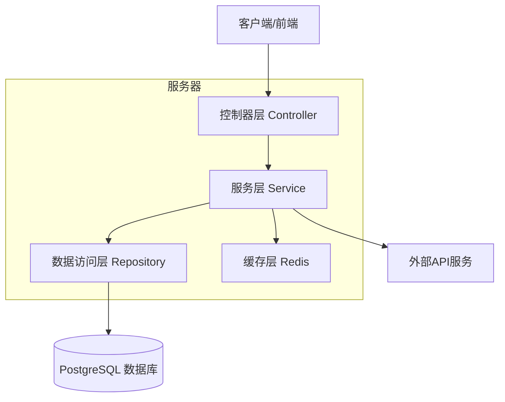
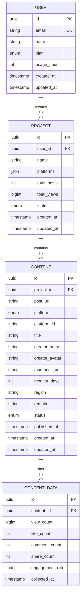

# 内容监控平台 - 技术架构文档

## 1. 架构设计



## 2. 技术描述

- **前端**: Next.js@14 + React@18 + TailwindCSS@3 + Zustand@4 + Lucide React图标
- **后端**: Node.js@20 + Express@4 + TypeScript@5 （或 Python FastAPI / Go Gin）
- **数据库**: Supabase (PostgreSQL) + Supabase SDK
- **缓存**: Redis@7 （可选）
- **文件处理**: Multer + XLSX / SheetJS
- **身份验证**: Supabase Auth

## 3. 路由定义

| 路由 | 用途 |
|------|------|
| / | 项目列表页（默认页面），显示所有项目和创建入口 |
| /login | 登录页面，用户身份验证 |
| /register | 注册页面，新用户注册 |
| /projects/[id] | 项目详情页，内容监控列表、统计数据、表格/卡片视图切换 |
| /api/auth/* | 身份验证相关API端点 |
| /api/projects/* | 项目管理相关API端点 |
| /api/contents/* | 内容监控相关API端点 |
| /api/upload/* | 文件上传和批量导入API端点 |

## 4. API定义

### 4.1 核心API

**用户认证相关（使用Supabase Auth）**
```
POST /api/auth/register
POST /api/auth/login
POST /api/auth/logout
GET /api/auth/user
```

**项目管理相关**
```
GET /api/projects
```
响应:
| 参数名 | 参数类型 | 描述 |
|--------|----------|------|
| projects | array | 项目列表，包含名称、创建时间、帖子数量、总观看量、平台图标、状态 |

```
POST /api/projects
```
请求参数:
| 参数名 | 参数类型 | 是否必需 | 描述 |
|--------|----------|----------|------|
| name | string | true | 项目名称 |
| platforms | array | true | 选择的平台列表 |

**内容监控相关**
```
GET /api/projects/:id/contents
```
响应:
| 参数名 | 参数类型 | 描述 |
|--------|----------|------|
| contents | array | 内容列表，包含创作者信息、平台、发布日期、统计数据、状态 |
| stats | object | 统计数据：总观看量、总点赞数、总评论数、总分享数、参与率 |

```
POST /api/projects/:id/contents
```
请求参数:
| 参数名 | 参数类型 | 是否必需 | 描述 |
|--------|----------|----------|------|
| post_url | string | true | 内容链接 |
| monitor_days | number | false | 监控天数（30/60/90） |
| region | string | false | 地区设置 |
| remark | string | false | 备注或标签 |

```
POST /api/projects/:id/contents/batch
```
请求参数:
| 参数名 | 参数类型 | 是否必需 | 描述 |
|--------|----------|----------|------|
| file | file | true | Excel文件（.xlsx格式） |

响应:
| 参数名 | 参数类型 | 描述 |
|--------|----------|------|
| success_count | number | 成功导入数量 |
| failed_count | number | 失败数量 |
| failed_rows | array | 失败行详情和错误原因 |

**文件上传相关**
```
POST /api/upload/excel
```
请求参数:
| 参数名 | 参数类型 | 是否必需 | 描述 |
|--------|----------|----------|------|
| file | file | true | Excel文件 |

示例请求:
```json
{
  "name": "美妆博主监控项目",
  "platforms": ["youtube", "tiktok", "instagram"]
}
```

## 5. 服务器架构图



## 6. 数据模型

### 6.1 数据模型定义



### 6.2 数据定义语言（Supabase SQL）

**用户表 (users) - 使用Supabase Auth**
```sql
-- Supabase自动创建 auth.users表，我们只需要扩展用户信息
CREATE TABLE public.user_profiles (
    id UUID PRIMARY KEY REFERENCES auth.users(id) ON DELETE CASCADE,
    name VARCHAR(100),
    plan VARCHAR(20) DEFAULT 'free' CHECK (plan IN ('free', 'premium')),
    usage_count INTEGER DEFAULT 0,
    created_at TIMESTAMP WITH TIME ZONE DEFAULT NOW(),
    updated_at TIMESTAMP WITH TIME ZONE DEFAULT NOW()
);

-- 创建索引
CREATE INDEX idx_user_profiles_plan ON user_profiles(plan);

-- 设置RLS策略
ALTER TABLE user_profiles ENABLE ROW LEVEL SECURITY;
CREATE POLICY "Users can view own profile" ON user_profiles FOR SELECT USING (auth.uid() = id);
CREATE POLICY "Users can update own profile" ON user_profiles FOR UPDATE USING (auth.uid() = id);
```

**项目表 (projects)**
```sql
-- 创建项目表
CREATE TABLE projects (
    id UUID PRIMARY KEY DEFAULT gen_random_uuid(),
    user_id UUID NOT NULL REFERENCES auth.users(id) ON DELETE CASCADE,
    name VARCHAR(200) NOT NULL,
    platforms JSONB DEFAULT '[]',
    total_posts INTEGER DEFAULT 0,
    total_views BIGINT DEFAULT 0,
    status VARCHAR(20) DEFAULT 'active' CHECK (status IN ('active', 'paused', 'completed')),
    created_at TIMESTAMP WITH TIME ZONE DEFAULT NOW(),
    updated_at TIMESTAMP WITH TIME ZONE DEFAULT NOW()
);

-- 创建索引
CREATE INDEX idx_projects_user_id ON projects(user_id);
CREATE INDEX idx_projects_created_at ON projects(created_at DESC);

-- 设置RLS策略
ALTER TABLE projects ENABLE ROW LEVEL SECURITY;
CREATE POLICY "Users can manage own projects" ON projects FOR ALL USING (auth.uid() = user_id);
```

**内容表 (contents)**
```sql
-- 创建内容表
CREATE TABLE contents (
    id UUID PRIMARY KEY DEFAULT gen_random_uuid(),
    project_id UUID NOT NULL REFERENCES projects(id) ON DELETE CASCADE,
    post_url TEXT NOT NULL,
    platform VARCHAR(20) NOT NULL CHECK (platform IN ('youtube', 'tiktok', 'instagram')),
    platform_id VARCHAR(100) NOT NULL,
    title VARCHAR(500),
    creator_name VARCHAR(200),
    creator_avatar TEXT,
    thumbnail_url TEXT,
    monitor_days INTEGER DEFAULT 30 CHECK (monitor_days IN (30, 60, 90)),
    region VARCHAR(50),
    remark TEXT,
    status VARCHAR(20) DEFAULT 'pending' CHECK (status IN ('pending', 'monitoring', 'completed', 'error')),
    published_at TIMESTAMP WITH TIME ZONE,
    created_at TIMESTAMP WITH TIME ZONE DEFAULT NOW(),
    updated_at TIMESTAMP WITH TIME ZONE DEFAULT NOW(),
    UNIQUE(project_id, platform_id)
);

-- 创建索引
CREATE INDEX idx_contents_project_id ON contents(project_id);
CREATE INDEX idx_contents_platform ON contents(platform);
CREATE INDEX idx_contents_status ON contents(status);
CREATE INDEX idx_contents_published_at ON contents(published_at DESC);

-- 设置RLS策略
ALTER TABLE contents ENABLE ROW LEVEL SECURITY;
CREATE POLICY "Users can manage contents in own projects" ON contents FOR ALL 
USING (project_id IN (SELECT id FROM projects WHERE user_id = auth.uid()));
```

**内容数据表 (content_data)**
```sql
-- 创建内容数据表
CREATE TABLE content_data (
    id UUID PRIMARY KEY DEFAULT gen_random_uuid(),
    content_id UUID NOT NULL REFERENCES contents(id) ON DELETE CASCADE,
    view_count BIGINT DEFAULT 0,
    like_count INTEGER DEFAULT 0,
    comment_count INTEGER DEFAULT 0,
    share_count INTEGER DEFAULT 0,
    engagement_rate DECIMAL(5,4) DEFAULT 0,
    collected_at TIMESTAMP WITH TIME ZONE DEFAULT NOW()
);

-- 创建索引
CREATE INDEX idx_content_data_content_id ON content_data(content_id);
CREATE INDEX idx_content_data_collected_at ON content_data(collected_at DESC);

-- 设置RLS策略
ALTER TABLE content_data ENABLE ROW LEVEL SECURITY;
CREATE POLICY "Users can view data for own contents" ON content_data FOR SELECT 
USING (content_id IN (
    SELECT c.id FROM contents c 
    JOIN projects p ON c.project_id = p.id 
    WHERE p.user_id = auth.uid()
));

-- 初始化数据示例
INSERT INTO projects (user_id, name, platforms) VALUES 
('00000000-0000-0000-0000-000000000000', '示例项目', '["youtube", "tiktok"]');
```

**权限设置**
```sql
-- 给anon角色基本读取权限
GRANT SELECT ON user_profiles TO anon;
GRANT SELECT ON projects TO anon;
GRANT SELECT ON contents TO anon;
GRANT SELECT ON content_data TO anon;

-- 给authenticated角色全部权限
GRANT ALL PRIVILEGES ON user_profiles TO authenticated;
GRANT ALL PRIVILEGES ON projects TO authenticated;
GRANT ALL PRIVILEGES ON contents TO authenticated;
GRANT ALL PRIVILEGES ON content_data TO authenticated;
```